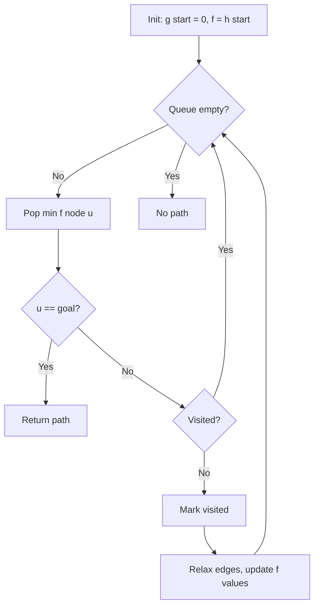

# A* Algorithm

> A* finds the shortest path from a source to a target by combining Dijkstra's algorithm with a heuristic that estimates distance to goal.

|  | Complexity |
|--------|-------|
| Time | O((V + E) log V) worst case, often much better |
| Space | O(V) |

- Requires a **heuristic** $h(v)$ estimating cost from $v$ to goal
- Optimal if heuristic is **admissible**
- Efficient if heuristic is **consistent**

## Pipeline

Expand nodes by lowest $f(v) = g(v) + h(v)$, where $g(v)$ is the known cost from start.

```
g[start] = 0
f[start] = h(start)
queue.push(start, priority=f[start])

while queue not empty:
    u = queue.pop_min()
    if u == goal: return path
    if visited[u]: continue
    visited[u] = true

    for each edge (u -> v, weight w):
        tentative_g = g[u] + w
        if tentative_g < g[v]:
            g[v] = tentative_g
            f[v] = g[v] + h(v)
            parent[v] = u
            queue.push(v, priority=f[v])
```



## Intuition

A* uses:

$$
f(v) = g(v) + h(v)
$$

- $g(v)$: actual cost from start to $v$ (like Dijkstra)
- $h(v)$: estimated cost from $v$ to goal (heuristic)
- $f(v)$: estimated total path cost through $v$

When $h(v) = 0$ for all $v$, A* reduces to Dijkstra.

**Admissibility.** A heuristic is admissible if it never overestimates:

$$
h(v) \leq \delta(v, \text{goal}) \quad \forall v
$$

Guarantees optimality: never skip a node that could be on the shortest path.

**Consistency.** A heuristic is consistent if it satisfies:

$$
h(u) \leq w(u, v) + h(v) \quad \forall \text{ edges } (u, v)
$$

Consistency implies admissibility. With a consistent heuristic, once a node is visited, its $g$ value is optimal (like Dijkstra).

**Common heuristics** (for grid/geometric problems):
- Euclidean distance: $h(v) = \|v - \text{goal}\|_2$
- Manhattan distance: $h(v) = |x_v - x_g| + |y_v - y_g|$

## Why it works

The heuristic biases search toward the goal. Nodes "in the wrong direction" have high $h(v)$, so high $f(v)$, so they're expanded later (or never).

Best case: heuristic is perfect ($h(v) = \delta(v, \text{goal})$), and A* expands only nodes on the optimal path.

Worst case: $h(v) = 0$, and A* becomes Dijkstra, exploring in all directions.

## Ref.

- [OG study for A*](https://ieeexplore.ieee.org/document/4082128)
