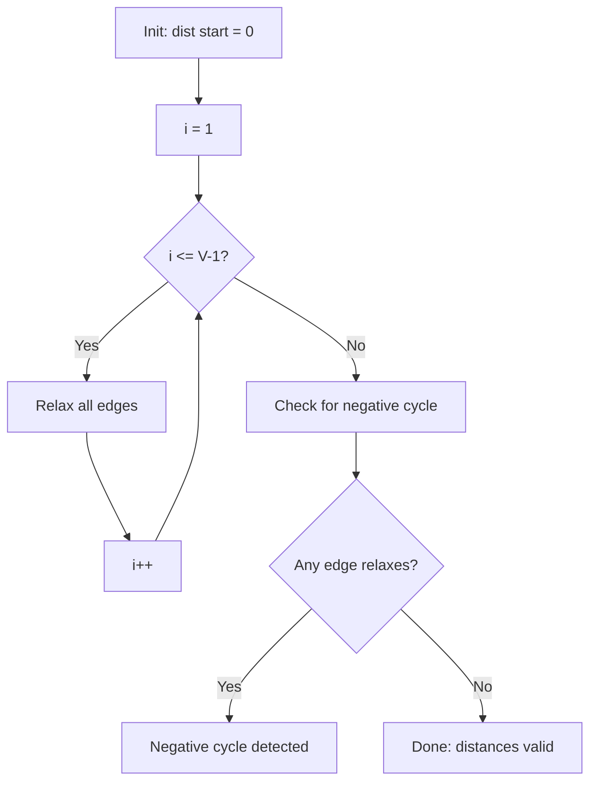

# Bellman-Ford Algorithm

> Bellman-Ford finds shortest paths from a source vertex to all other vertices, handling negative edge weights and detecting negative cycles.

<table>
  <tr>
    <td align="center"><br/><b>Maze</b></td>
    <td align="center"><br/><b>Undirected Euclidean graph</b></td>
  </tr>
</table>

|  | Complexity |
|--------|-------|
| Time | O(V * E) |
| Space | O(V) |

- Handles **negative edge weights**
- Detects **negative cycles** (returns `negative_cycle: true`)
- Slower than Dijkstra, but more general

## Pipeline

Relax all edges |V| - 1 times. Then check for negative cycles with one more pass.

```
dist[start] = 0
dist[all others] = infinity

for i = 1 to |V| - 1:
    for each edge (u -> v, weight w):
        if dist[u] + w < dist[v]:
            dist[v] = dist[u] + w
            parent[v] = u

// Negative cycle detection
for each edge (u -> v, weight w):
    if dist[u] + w < dist[v]:
        return NEGATIVE_CYCLE
```



## Intuition

**IMPORTANT: |V| - 1 iterations?**

Any shortest path has at most |V| - 1 edges (otherwise it contains a cycle, loopback to same node). After $k$ iterations, we've found all shortest paths using at most $k$ edges.

Let $d_k[v]$ be the shortest distance to $v$ using at most $k$ edges:

$$
d_k[v] = \min_{(u,v) \in E} \left( d_{k-1}[u] + w(u,v) \right)
$$

After |V| - 1 iterations: $d[v] = \delta(s, v)$ for all reachable $v$.

**Negative cycle.**

If any edge can still be relaxed after |V| - 1 iterations, a negative cycle exists, because if shortest paths existed, they'd all be found by now. Any further improvement means we can keep going around a cycle forever, decreasing distance.

$$
\exists (u, v): d[u] + w(u,v) < d[v] \implies \text{negative cycle reachable from } s
$$

**When to use Bellman-Ford over Dijkstra?**

| Scenario | Algorithm |
|----------|-----------|
| All weights non-negative | Dijkstra (faster) |
| Negative weights, no cycles | Bellman-Ford |
| Need cycle detection | Bellman-Ford |
| Dense graph, negative weights | Bellman-Ford |

## Configuration

```rust
BellmanFordConfig {
    base: SsspConfig,        // inherited (early_stop, etc.)
    early_termination: bool, // default: true - stop if no relaxations
}
```

**Early termination.** If a full pass over all edges produces no improvements, the algorithm can terminate early. This optimization doesn't change worst-case complexity but can help.

## Usage

```rust
use sssp_fast::{AdjListGraph, SsspBuffers, cheeky_bellman_ford, Dyn};

let mut graph: AdjListGraph<f64> = AdjListGraph::new(4);
graph.add_edge(0, 1, 4.0);
graph.add_edge(1, 2, -2.0);  // negative weight OK
graph.add_edge(2, 3, 3.0);

let mut buffers: SsspBuffers<f64, Dyn> = SsspBuffers::new_inf(Dyn(4));
let result = cheeky_bellman_ford(&graph, 0, &mut buffers);

if result.negative_cycle {
    println!("Negative cycle detected!");
} else {
    // buffers.dist[v] = shortest distance from source to v
    // buffers.path_to(v) = reconstructed path
}
```

**Negative cycle example:**

```rust
let mut graph: AdjListGraph<f64> = AdjListGraph::new(3);
graph.add_edge(0, 1, 1.0);
graph.add_edge(1, 2, 1.0);
graph.add_edge(2, 0, -3.0);  // cycle total: -1

let result = cheeky_bellman_ford(&graph, 0, &mut buffers);
assert!(result.negative_cycle);  // detected!
```

## Ref.

- [OG Bellman](https://www.ams.org/journals/qam/1958-16-01/S0033-569X-1958-0102435-2/)
