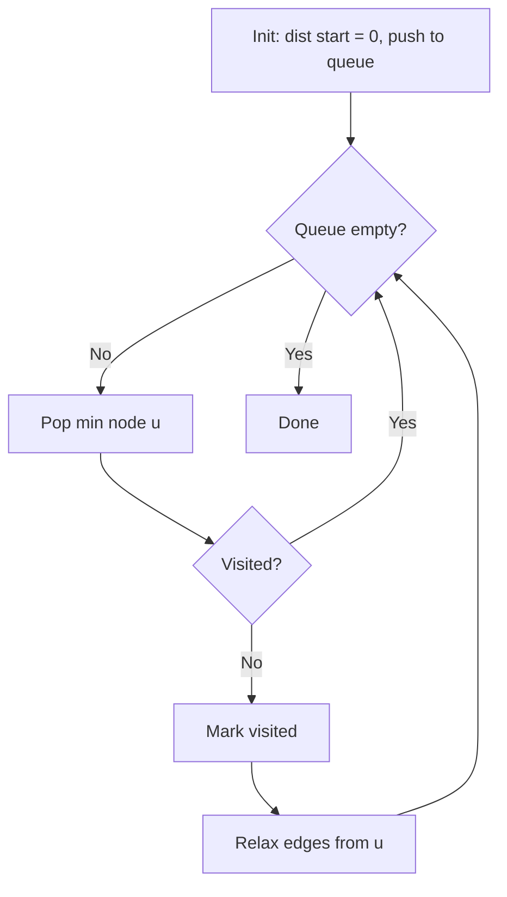

# Dijkstra's Algorithm

> Dijkstra's algorithm finds shortest paths from a source vertex to all other vertices in a weighted graph with non-negative edge weights.

<table>
  <tr>
    <td align="center"><br/><b>Maze</b></td>
    <td align="center"><br/><b>Undirected Euclidean graph</b></td>
  </tr>
</table>

|  | Complexity |
|--------|-------|
| Time | O((V + E) log V) |
| Space | O(V) distances + O(V) heap |

- All edge weights must be **non-negative**
- Graph can be directed or undirected

## Pipeline

Always expand the closest unvisited node. Use a priority queue to find the minimum efficiently.

```
dist[start] = 0
dist[all others] = infinity
queue.push(start)

while queue not empty:
    u = queue.pop_min()
    if visited[u]: continue
    visited[u] = true

    for each edge (u -> v, weight w):
        if dist[u] + w < dist[v]:
            dist[v] = dist[u] + w
            parent[v] = u
            queue.push(v)
```



Let $\delta(s, v)$ be the true shortest path distance from source $s$ to $v$.

**Relaxation.** For edge $(u, v)$ with weight $w$:

$$
d[v] \leftarrow \min(d[v], \; d[u] + w)
$$

Any shortest path $s \rightsquigarrow v$ through $u$ has length $\delta(s, u) + w(u, v)$.

**Greedy invariant.** When node $u$ is popped from the queue: $d[u] = \delta(s, u)$.

*Proof-ish* Suppose not. Then some shorter path $s \rightsquigarrow u$ exists through an unvisited node $x$. But $d[x] \geq d[u]$ (otherwise $x$ would have been popped first), and $w(x, u) \geq 0$, so $d[x] + w(x, u) \geq d[u]$. Contradiction.

**Non-negative weights?** If $w < 0$, we could have $d[x] + w < d[u]$ even when $d[x] > d[u]$, breaking the invariant.

## Configuration

```rust
DijkstraConfig {
    base: SsspConfig,      // inherited (early_stop, etc.)
    lazy_deletion: bool,   // default: true
}
```

## Usage

```rust
use sssp_fast::{AdjListGraph, SsspBuffers, dijkstra, Dyn};

let mut graph: AdjListGraph<f64> = AdjListGraph::new(4);
graph.add_edge(0, 1, 1.0);
graph.add_edge(1, 2, 2.0);

let mut buffers: SsspBuffers<f64, Dyn> = SsspBuffers::new_inf(Dyn(4));
let result = dijkstra(&graph, 0, &mut buffers);

// buffers.dist[v] = shortest distance from source to v
// buffers.path_to(v) = reconstructed path
```

## Ref.

- [The OG himself](https://ir.cwi.nl/pub/9256/9256D.pdf)
