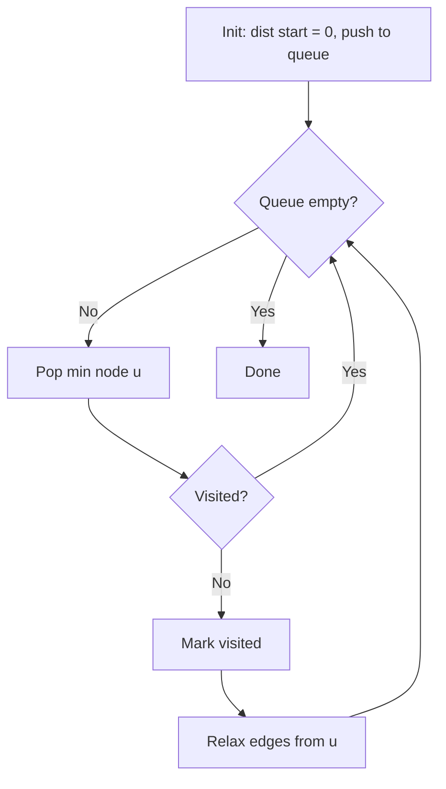

# Dijkstra's Algorithm


<div align="center">


<p><b>Figure:</b>Dijkstra's algorithm finds shortest paths from a source vertex to all other vertices in a weighted graph with non-negative edge weights.</p>

</div>

|  | Complexity |
|--------|-------|
| Time | O((V + E) log V) |
| Space | O(V) distances + O(V) heap |

- All edge weights must be **non-negative**
- Graph can be directed or undirected

## Pipeline

Always expand the closest unvisited node. Use a priority queue to find the minimum efficiently.

```
dist[start] = 0
dist[all others] = infinity
queue.push(start)

while queue not empty:
    u = queue.pop_min()
    if visited[u]: continue
    visited[u] = true

    for each edge (u -> v, weight w):
        if dist[u] + w < dist[v]:
            dist[v] = dist[u] + w
            parent[v] = u
            queue.push(v)
```



When a node is popped, its distance is final. Any alternative path must go through an unvisited node, which has distance >= the popped node (otherwise we would have popped that one). Negative edges break this invariant.

## Configuration

```rust
DijkstraConfig {
    base: SsspConfig,      // inherited (early_stop, etc.)
    lazy_deletion: bool,   // default: true
}
```

## Usage

```rust
use sssp_fast::{AdjListGraph, SsspBuffers, dijkstra, Dyn};

let mut graph: AdjListGraph<f64> = AdjListGraph::new(4);
graph.add_edge(0, 1, 1.0);
graph.add_edge(1, 2, 2.0);

let mut buffers: SsspBuffers<f64, Dyn> = SsspBuffers::new_inf(Dyn(4));
let result = dijkstra(&graph, 0, &mut buffers);

// buffers.dist[v] = shortest distance from source to v
// buffers.path_to(v) = reconstructed path
```

## Ref.

- [The OG himself](https://ir.cwi.nl/pub/9256/9256D.pdf)
