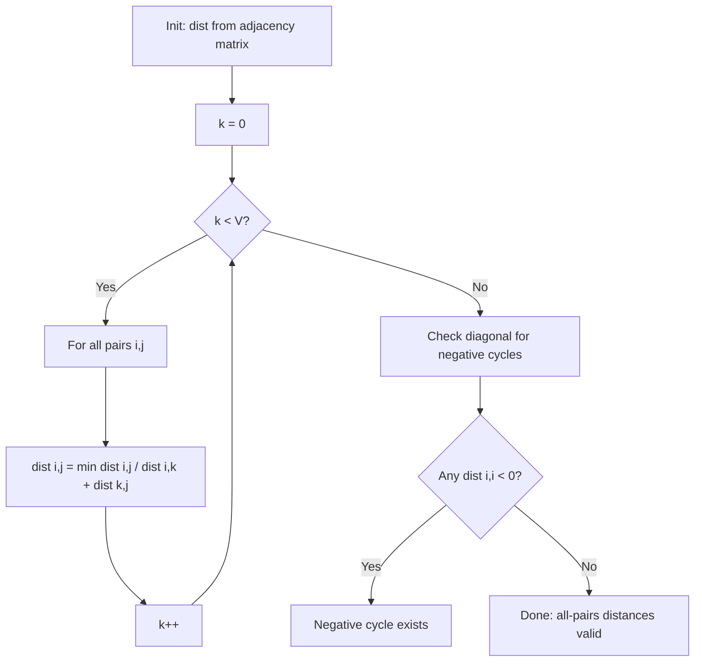

# Floyd-Warshall Algorithm

> Floyd-Warshall computes shortest paths between all pairs of vertices. Handles negative weights, detects negative cycles.

|  | Complexity |
|--------|-------|
| Time | O(V³) |
| Space | O(V²) |

- **All-pairs** shortest paths (not single-source)
- Handles **negative edge weights**
- Detects **negative cycles** (diagonal becomes negative)

## Pipeline

For each pair (i, j), consider whether routing through vertex k improves the path.

```
dist[i][j] = weight(i, j) if edge exists, else infinity
dist[i][i] = 0

for k = 0 to |V| - 1:
    for i = 0 to |V| - 1:
        for j = 0 to |V| - 1:
            if dist[i][k] + dist[k][j] < dist[i][j]:
                dist[i][j] = dist[i][k] + dist[k][j]

// Negative cycle detection
for i = 0 to |V| - 1:
    if dist[i][i] < 0:
        return NEGATIVE_CYCLE
```



## Intuition

**DP over intermediate vertices.**

Let $d_k[i][j]$ be the shortest path from $i$ to $j$ using only vertices $\{0, 1, ..., k-1\}$ as intermediates.

$$
d_k[i][j] = \min\left( d_{k-1}[i][j], \; d_{k-1}[i][k] + d_{k-1}[k][j] \right)
$$

Either the shortest path doesn't use $k$, or it goes through $k$ exactly once.

**Ordering.**

When computing $d_k[i][j]$, we need $d_{k-1}[i][k]$ and $d_{k-1}[k][j]$. But:
- $d_k[i][k] = d_{k-1}[i][k]$ (path to $k$ doesn't use $k$ as intermediate)
- $d_k[k][j] = d_{k-1}[k][j]$ (path from $k$ doesn't use $k$ as intermediate)

So can update in-place without storing previous iter.

**Negative cycle detection.**

After all iters, $d[i][i]$ should be 0. If $d[i][i] < 0$, negative cycle through $i$.

$$
d[i][i] < 0 \implies \text{negative cycle through } i
$$

## Ref.

- [OG Intro](https://dl.acm.org/doi/10.1145/367766.368168)
