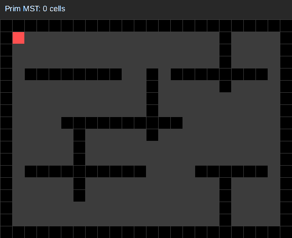
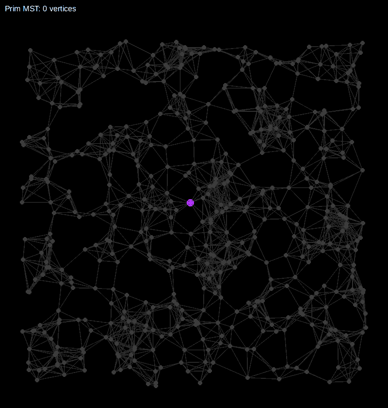
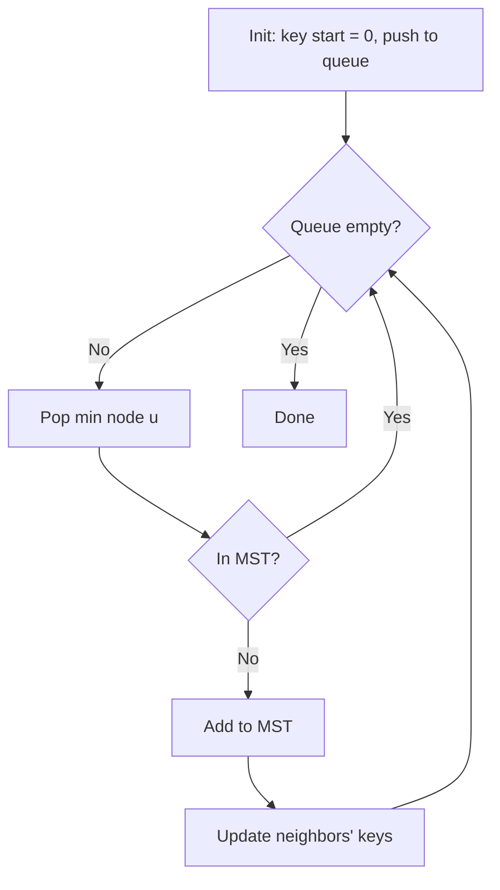

# Prim's Algorithm

> Prim's algorithm finds a Minimum Spanning Tree (MST) of a connected, undirected, weighted graph.

<table>
  <tr>
    <td align="center"><br/><b>Maze</b></td>
    <td align="center"><br/><b>Undirected Euclidean graph</b></td>
  </tr>
</table>


|  | Complexity |
|--------|-------|
| Time | O((V + E) log V) |
| Space | O(V) keys + O(V) heap |

- All edge weights must be **non-negative**
- Graph must be **undirected** (add edges both ways)
- Finds MST for connected component containing the source

## Pipeline

Grow the MST one vertex at a time. Always add the minimum weight edge crossing the cut.

```
key[start] = 0
key[all others] = infinity
queue.push(start)

while queue not empty:
    u = queue.pop_min()
    if in_mst[u]: continue
    in_mst[u] = true

    for each edge (u -- v, weight w):
        if not in_mst[v] and w < key[v]:
            key[v] = w
            parent[v] = u
            queue.push(v)
```



## Intuition

**Cut property.** For any cut of the graph, the minimum weight edge crossing the cut belongs to some MST.

Let $S$ be the set of vertices in the MST so far. At each step:

$$
\text{next vertex} = \arg\min_{v \notin S} \left( \min_{u \in S} w(u, v) \right)
$$

**Key vs Distance.** Unlike Dijkstra which tracks cumulative distance from source, Prim tracks minimum edge weight to connect each vertex to the MST.

| | Dijkstra | Prim |
|--|----------|------|
| Tracks | dist[v] = path length from source | key[v] = min edge weight to MST |
| Updates | dist[v] = dist[u] + w | key[v] = w |
| Solves | Shortest paths | Minimum spanning tree |

**MST uniqueness.** If all edge weights are distinct, MST is unique. With ties, multiple valid MSTs may exist.

## Configuration

```rust
PrimConfig {
    lazy_deletion: bool,   // default: true
}
```

## Usage

```rust
use sssp_fast::{AdjListGraph, MstBuffers, cheeky_prim, Dyn};

let mut graph: AdjListGraph<f64> = AdjListGraph::new(4);

// Undirected: add edges both ways
graph.add_edge(0, 1, 4.0); graph.add_edge(1, 0, 4.0);
graph.add_edge(0, 2, 2.0); graph.add_edge(2, 0, 2.0);
graph.add_edge(1, 2, 1.0); graph.add_edge(2, 1, 1.0);
graph.add_edge(2, 3, 5.0); graph.add_edge(3, 2, 5.0);

let mut buffers: MstBuffers<f64, Dyn> = MstBuffers::new_inf(Dyn(4));
let result = cheeky_prim(&graph, 0, &mut buffers);

// result.total_weight = sum of MST edge weights
// result.is_connected = true if all vertices reached
// buffers.collect_edges() = MST edges
```

## Ref.

- [OG Bell Labs](https://ieeexplore.ieee.org/document/6773228)
