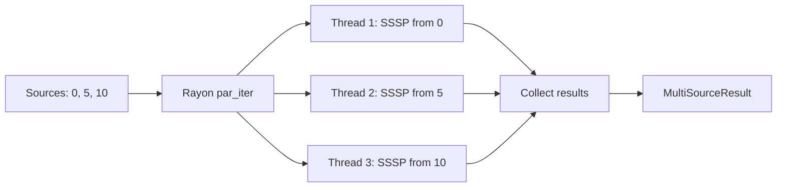

# Parallel Multi-Source SSSP

> Run SSSP from multiple sources concurrently using rayon.

|  | Complexity |
|--------|-------|
| Time | O(k × SSSP) / num_threads |
| Space | O(k × V) buffers |

Where k = number of sources.

## Usage

```rust
use sssp_fast::{parallel_sssp, Dijkstra, Dyn};

let sources = vec![0, 5, 10];
let result = parallel_sssp::<f64, Dyn, _, _, _>(&graph, &sources, || Dijkstra::new());

result.dist(0, 4) // distance from source 0 to vertex 4
result.path(1, 3) // path from source 5 to vertex 3
result.total_iterations()
```

## Concurrancy



Each thread:
1. Creates fresh algorithm instance via factory
2. Allocates owned buffers
3. Runs SSSP independently + concurrently

Graph is shared, safe, read-only across threads.

## All-pairs

```rust
use sssp_fast::{all_pairs_sssp, Dijkstra, Dyn};

let result = all_pairs_sssp::<f64, Dyn, _, _, _>(&graph, || Dijkstra::new());
// result.dist(i, j) = shortest distance from i to j
```

Warning: O(V²) space.
